# Multi-Phase Implementation Hand-off Protocol (MIPHP)

## 🎯 Purpose

This SOP defines the mandatory hand-off procedures for multi-phase implementations, ensuring seamless knowledge transfer between agents working on sequential phases of complex features.

## 📋 Scope

Applies to all multi-phase implementations where:
- A single feature spans multiple development sessions
- Different agents work on sequential phases
- Implementation requires specialized knowledge transfer
- Complex architectural changes need detailed context

## 🔐 **MANDATORY REQUIREMENTS**

### **CRITICAL**: Hand-off Completion Before Phase End

**🚫 BLOCKING**: Multi-phase implementations **CANNOT** proceed to the next phase without completing ALL hand-off requirements.

**✅ VERIFICATION**: Automated script validates hand-off completion:
```bash
.agent/scripts/verify_handoff_compliance.sh --phase <phase-id>
```

## 📊 Hand-off Document Requirements

### 1. **Executive Summary** (Required)
- **Feature Context**: Brief overview of the overall feature goal
- **Current Phase Summary**: What was accomplished in this phase
- **Next Phase Objectives**: Clear, measurable goals for the next agent
- **Critical Decisions**: Key architectural and implementation decisions made
- **Risk Assessment**: Current risks and mitigation strategies

### 2. **Technical Context** (Required)
- **Architecture Changes**: Modified components and their relationships
- **Code Modifications**: Specific files changed with rationale
- **Configuration Updates**: Environment, schema, or dependency changes
- **API Changes**: New/modified endpoints with documentation
- **Database Changes**: Schema migrations or data transformations

### 3. **Knowledge Transfer** (Required)
- **Implementation Patterns**: Key patterns and conventions used
- **Technical Debt**: Known issues and future improvement opportunities
- **Testing Strategy**: Test coverage status and gaps
- **Performance Considerations**: Benchmarks, bottlenecks, optimizations
- **Security Implications**: Security changes and remaining considerations

### 4. **Navigation & Onboarding** (Required)
- **Entry Points**: Where the next agent should start working
- **Critical Files**: Most important files to understand
- **Dependencies**: Required tools, libraries, and services
- **Environment Setup**: Specific setup requirements
- **Debug Information**: Common issues and troubleshooting steps

### 5. **Quality & Validation** (Required)
- **Tests Status**: Current test coverage and results
- **Quality Gates**: Passed/failed quality checks
- **Code Review**: Review feedback and resolutions
- **Documentation**: Updated documentation status
- **Compliance**: Regulatory or standards compliance status

## 🔄 Hand-off Workflow

### Phase End Protocol

```mermaid
graph TD
    A[Phase Complete] --> B{Create Hand-off Document}
    B --> C{Automated Verification}
    C -->|Pass| D{Agent Review}
    C -->|Fail| E[Fix Issues]
    E --> B
    D -->|Pass| F[Store Hand-off]
    D -->|Fail| G[Revise Document]
    G --> B
    F --> H[Update Phase Status]
    H --> I[Notify Next Agent]
    I --> J[✅ Hand-off Complete]
```



### Hand-off Storage

Hand-off documents are stored in:
```
.agent/handoffs/
├── <feature-name>/
│   ├── phase-01-handoff.md
│   ├── phase-02-handoff.md
│   └── summary.md
```

## 🤖 Agent Responsibilities

### **Current Phase Agent** (Hand-off Creator)
1. **Complete Implementation**: Finish all phase deliverables
2. **Document Everything**: Create comprehensive hand-off document
3. **Run Verification**: Execute automated compliance check
4. **Store Document**: Save in designated hand-off location
5. **Update Status**: Mark phase as complete in tracking system
6. **Notify Successor**: Ensure next agent knows hand-off is ready

### **Next Phase Agent** (Hand-off Recipient)
1. **Review Document**: Read entire hand-off before starting
2. **Validate Understanding**: Confirm comprehension of technical context
3. **Verify Environment**: Ensure development environment matches requirements
4. **Ask Questions**: Clarify any ambiguities before beginning work
5. **Acknowledge Receipt**: Confirm hand-off acceptance in tracking system

## 🔍 Automated Verification Script

### Script Location
`.agent/scripts/verify_handoff_compliance.sh`

### Verification Checks

```bash
# Required sections validation
✅ Executive Summary exists and meets minimum length
✅ Technical Context includes all required subsections
✅ Knowledge Transfer covers all specified areas
✅ Navigation & Onboarding provides entry points
✅ Quality & Validation includes current status

# Quality checks
✅ Document follows markdown formatting standards
✅ All internal links resolve correctly
✅ Code blocks are properly formatted
✅ File references are accurate
✅ No duplicate or contradictory information

# Integration checks
✅ Hand-off stored in correct location
✅ Phase status updated in tracking system
✅ Next agent notified (if specified)
✅ Beads task updated with hand-off reference
```

### Usage

```bash
# Verify specific phase hand-off
.agent/scripts/verify_handoff_compliance.sh --phase <phase-id>

# Verify all hand-offs for feature
.agent/scripts/verify_handoff_compliance.sh --feature <feature-name>

# Interactive verification with detailed feedback
.agent/scripts/verify_handoff_compliance.sh --interactive --phase <phase-id>

# Generate compliance report
.agent/scripts/verify_handoff_compliance.sh --report --feature <feature-name>
```

## 📏 Quality Standards

### Document Quality Metrics

| Metric | Requirement | Measurement |
|--------|------------|-------------|
| **Completeness** | 100% of required sections present | Automated scan |
| **Accuracy** | All technical details correct | Peer review |
| **Clarity** | Clear, unambiguous language | Readability score |
| **Usability** | Next agent can start work | Time-to-productivity |
| **Maintainability** | Easy to update and maintain | Document structure |

### Minimum Content Requirements

- **Executive Summary**: Minimum 300 words
- **Technical Context**: All modified files referenced
- **Knowledge Transfer**: At least 3 implementation patterns
- **Navigation**: Minimum 5 entry points identified
- **Quality**: Current test coverage percentage

## 🚨 Emergency Procedures

### **Incomplete Hand-off Recovery**

If a hand-off is incomplete or missing:

1. **Immediate Notification**: Alert project coordinator
2. **Context Reconstruction**: Use git history and documentation
3. **Minimal Hand-off**: Create emergency hand-off with available info
4. **Risk Assessment**: Document increased risk due to incomplete hand-off
5. **Enhanced Monitoring**: Increased oversight for next phase

### **Hand-off Quality Issues**

If hand-off quality is insufficient:

1. **Reject Hand-off**: Next agent can reject inadequate hand-offs
2. **Rework Required**: Current agent must improve the document
3. **Mediation**: Project coordinator may facilitate resolution
4. **Template Enforcement**: Use stricter templates for future hand-offs

## 📈 Integration with Mission Debriefing

### **Reflect Evaluation Criteria**

The `reflect` skill evaluation explicitly includes hand-off quality:

```
Hand-off Procedure Quality:
- ✅ Document completeness (all required sections)
- ✅ Technical accuracy (no missing or incorrect information)
- ✅ Clarity for successor agent (understandable by new agent)
- ✅ Automated verification (script passes all checks)
- ✅ Process efficiency (time to create vs. value delivered)
```

### **Mission Debriefing Assessment**

The `mission-debriefing` skill evaluates:

```
Multi-Phase Implementation Effectiveness:
- Hand-off document quality score
- Successor agent time-to-productivity
- Number of clarification questions needed
- Rework required due to incomplete information
- Overall phase transition success rate
```

## 🔗 Integration Points

### **Flight Director Integration**

Flight Director validates hand-off completion during phase transitions:

```yaml
phase_transition:
  require_handoff_document: true
  verify_handoff_quality: true
  block_on_incomplete_handoff: true
```

### **Beads Integration**

Hand-off status is tracked in beads tasks:

```bash
# Mark hand-off complete
bd update <task-id> --handoff-complete --handoff-doc <path>

# Link hand-off to next phase task
bd link <current-task> <next-task> --type handoff
```

### **Git Workflow Integration**

Hand-off documents are versioned with the codebase:

```bash
# Commit hand-off with phase completion
git add .agent/handoffs/<feature>/phase-XX-handoff.md
git commit -m "Phase XX completed - Hand-off document added"

# Tag phase completion
git tag phase-XX-complete
```

## 📚 Templates

### **Hand-off Document Template**

```markdown
# Feature: <Feature Name> - Phase <Phase Number> Hand-off

## Executive Summary
[Overview of feature and current phase status]

## Technical Context
### Architecture Changes
[Detailed architectural modifications]

### Code Modifications
[Files changed with rationale]

### Configuration Updates
[Environment, schema, dependency changes]

### API Changes
[New/modified endpoints]

### Database Changes
[Schema migrations, data transformations]

## Knowledge Transfer
### Implementation Patterns
[Key patterns and conventions]

### Technical Debt
[Known issues and improvements]

### Testing Strategy
[Test coverage and gaps]

### Performance Considerations
[Benchmarks and optimizations]

### Security Implications
[Security changes and considerations]

## Navigation & Onboarding
### Entry Points
[Where to start working]

### Critical Files
[Most important files]

### Dependencies
[Required tools, libraries, services]

### Environment Setup
[Specific setup requirements]

### Debug Information
[Troubleshooting steps]

## Quality & Validation
### Tests Status
[Test coverage and results]

### Quality Gates
[Passed/failed checks]

### Code Review
[Review feedback and resolutions]

### Documentation
[Updated documentation status]

### Compliance
[Regulatory compliance status]

## Next Phase Objectives
[Clear goals for next agent]

## Risk Assessment
[Current risks and mitigations]

## Contact Information
[Who to contact for questions]
```

## ✅ Success Metrics

### **Hand-off Quality Metrics**
- **100%** automated verification pass rate
- **<30 minutes** time for successor agent to start productive work
- **<5 questions** clarification requests from successor agent
- **0 rework** due to incomplete hand-off information

### **Process Efficiency Metrics**
- **<2 hours** time to create comprehensive hand-off
- **100%** on-time hand-off completion
- **95%** successor agent satisfaction rate
- **0 blocking** issues due to hand-off problems

---

**Status**: MANDATORY SOP
**Version**: 1.0.0
**Last Updated**: 2026-02-05
**Enforcement**: Automated verification blocks phase transitions
**Quality Assurance**: Reflect and Mission Debriefing evaluation includes hand-off quality

For questions or improvements, create a beads task with `handoff-sop` tag.
