# 🔄 SOP Integration Guide

**Purpose**: Guide for navigating between Global SOP standards and LightRAG-specific extensions.
**Target**: Agents working on LightRAG who need to understand protocol hierarchy and usage patterns.
**Scope**: LightRAG Project - maintains full global SOP compliance while adding project-specific requirements.

---

## 🎯 **Quick Decision Tree**

```mermaid
flowchart TD
    A[Start Task] --> B{Need Global Standards?}
    B -->|Yes| C[Read Global SOP First]
    B -->|No| D[Check Local Extensions]

    C --> E[Follow GEMINI.md SMP]
    E --> F[Apply Local Extensions]

    D --> G{TDD Development?}
    G -->|Yes| H[Use TDD Mandatory Gate]
    G -->|No| I[Multi-Phase Implementation?]
    I -->|Yes| J[Use Hand-off Protocol]
    I -->|No| K[Standard Workflow]

    F --> L[Complete Task]
    H --> L
    J --> L
    K --> L
```



---

## 📋 **Protocol Usage Matrix**

| **Scenario** | **Global SOP** | **Local Extension** | **Priority** |
|-------------|----------------|-------------------|-------------|
| **Basic Development** | `tdd-workflow.md` | None | Global only |
| **New Feature** | `tdd-workflow.md` | `TDD_MANDATORY_GATE.md` | Global → Local |
| **Multi-Phase Feature** | Standard SMP | `MULTI_PHASE_HANDOFF_PROTOCOL.md` | Global → Local |
| **Agent Coordination** | `COLLABORATION.md` | None | Global only |
| **Session Management** | `GEMINI.md` | None | Global only |
| **Performance Testing** | Universal TDD | `KEYWORD_SEARCH_PERFORMANCE.md` | Global → Local |

---

## 🌐 **Global SOP - Foundation Standards**

### **When to Use Global SOP Only**

**These scenarios require ONLY global standards:**

1. **Session Management**
   - Pre-Flight Checks (PFC)
   - Initialization procedures
   - Return To Base (RTB)
   - Collaboration protocols

2. **Basic Development**
   - Simple feature implementation
   - Standard bug fixes
   - Routine documentation updates

3. **Agent Coordination**
   - Multi-agent work allocation
   - Branch isolation rules
   - Session lock management

### **Global SOP Access**

```bash
# Primary location
~/.agent/docs/sop/README.md

# Key global documents
.agent/docs/sop/global-configs/GEMINI.md           # SMP & procedures
.agent/docs/sop/global-configs/COLLABORATION.md    # Multi-agent rules
.agent/docs/sop/global-configs/tdd-workflow.md     # Universal TDD
.agent/docs/sop/global-configs/AGENT_ONBOARDING.md # Onboarding
```

---

## 🔧 **LightRAG Extensions - Project-Specific**

### **When to Use Local Extensions**

**Enhanced requirements that extend global standards:**

1. **Enhanced TDD Development**
   - **Global Base**: Follow `tdd-workflow.md`
   - **Local Extension**: `TDD_MANDATORY_GATE.md`
   - **Triggers**: New features, performance-critical code, LLM modifications

2. **Multi-Phase Implementation**
   - **Global Base**: Standard SMP procedures
   - **Local Extension**: `MULTI_PHASE_HANDOFF_PROTOCOL.md`
   - **Triggers**: Complex features, multi-agent hand-offs, architectural changes

3. **Performance-Specific Work**
   - **Global Base**: Universal testing standards
   - **Local Extension**: `KEYWORD_SEARCH_PERFORMANCE.md`
   - **Triggers**: Performance optimizations, benchmarking, scalability work

### **Local Extension Access**

```bash
# LightRAG-specific extensions
.agent/docs/sop/TDD_MANDATORY_GATE.md                   # Enhanced TDD
.agent/docs/sop/MULTI_PHASE_HANDOFF_PROTOCOL.md        # Complex coordination
.agent/docs/sop/global-configs/KEYWORD_SEARCH_PERFORMANCE.md  # Performance
```

---

## ⚖️ **Conflict Resolution Protocol**

### **Hierarchy Rules**

1. **🥇 Global SOP is Supreme** - Never overridden by local rules
2. **🥈 Local Extensions Complement** - Add requirements, don't replace
3. **🥉 Workspace Rules are Temporary** - Must respect both global and local

### **Conflict Examples & Solutions**

#### **TDD Workflow Differences**

```bash
# Global requirement (tdd-workflow.md)
1. Write failing test
2. Implement minimal code
3. Verify test passes

# Local extension (TDD_MANDATORY_GATE.md) - ADDS requirements
1. Write failing test
2. Implement minimal code
3. Verify test passes
4. Run performance benchmarks ← NEW
5. Document speed-accuracy tradeoffs ← NEW
6. Pass automated quality gate ← NEW
```

#### **Multi-Phase Coordination**

```bash
# Global requirement (GEMINI.md SMP)
- Complete task
- Update documentation
- Hand off to next phase

# Local extension (MULTI_PHASE_HANDOFF_PROTOCOL.md) - ADDS requirements
- Complete task
- Update documentation
- Create comprehensive hand-off document ← NEW
- Verify automated checklist compliance ← NEW
- Record quality assessment metrics ← NEW
- Hand off to next phase
```

---

## 🔄 **Workflow Integration Examples**

### **Example 1: Simple Bug Fix**

```bash
# 1. Check global protocols
read .agent/docs/sop/global-configs/GEMINI.md  # SMP procedures
read .agent/docs/sop/global-configs/tdd-workflow.md  # TDD workflow

# 2. Follow global TDD workflow
write_failing_test()     # Red phase
implement_minimal_fix()  # Green phase
verify_test_passes()     # Verification

# 3. Standard global completion
update_documentation()
commit_and_push()

# No local extensions needed
```

### **Example 2: New Performance Feature**

```bash
# 1. Check global protocols (base requirements)
read .agent/docs/sop/global-configs/GEMINI.md
read .agent/docs/sop/global-configs/tdd-workflow.md

# 2. Apply local extensions (enhanced requirements)
read .agent/docs/sop/TDD_MANDATORY_GATE.md
read .agent/docs/sop/global-configs/KEYWORD_SEARCH_PERFORMANCE.md

# 3. Enhanced TDD workflow (global + local)
write_failing_test()           # Global TDD
implement_minimal_fix()        # Global TDD
verify_test_passes()           # Global TDD
run_performance_benchmarks()   # ← Local extension
document_tradeoffs()          # ← Local extension
pass_quality_gate()            # ← Local extension

# 4. Enhanced completion
update_documentation()
add_performance_notes()        # ← Local extension
commit_and_push()
```

### **Example 3: Multi-Phase Architecture**

```bash
# 1. Check global protocols (foundation)
read .agent/docs/sop/global-configs/GEMINI.md
read .agent/docs/sop/global-configs/COLLABORATION.md

# 2. Apply local extensions (complex coordination)
read .agent/docs/sop/MULTI_PHASE_HANDOFF_PROTOCOL.md

# 3. Phase 1 (global SMP + local hand-off preparation)
complete_phase_1_work()
create_handoff_documentation()  # ← Local extension
prepare_automated_verification() # ← Local extension

# 4. Phase 2 (receiving hand-off)
verify_handoff_compliance()     # ← Local extension
continue_phase_2_work()
```

---

## ✅ **Compliance Validation**

### **Validation Command Sequence**

```bash
# 1. Global SOP validation (always required)
python ~/.gemini/antigravity/skills/FlightDirector/scripts/check_flight_readiness.py --init
python ~/.gemini/antigravity/skills/FlightDirector/scripts/check_flight_readiness.py --finalize

# 2. Local extension validation (when applicable)
./scripts/validate_tdd_compliance.sh <feature-name>           # TDD Mandatory Gate
./scripts/verify_handoff_compliance.sh --phase <phase> --feature <feature>  # Multi-Phase

# 3. Integration verification
python ~/.agent/scripts/validate_sop_alignment.py             # Global/Local alignment
```

### **Validation Priority**

1. **Global compliance must pass first** - Cannot proceed if global validation fails
2. **Local extensions validated next** - Additional requirements for specific scenarios
3. **Integration verification final** - Ensures global/local protocols work together

---

## 🚨 **Common Pitfalls & Solutions**

### **Pitfall 1: Skipping Global Standards**

**❌ Wrong**: "I'm doing a LightRAG feature, so I'll only read local docs"
**✅ Correct**: Always read global standards first, then apply local extensions

### **Pitfall 2: Treating Extensions as Replacements**

**❌ Wrong**: "The TDD Mandatory Gate replaces the global TDD workflow"
**✅ Correct**: Local extensions add requirements to global standards, they don't replace them

### **Pitfall 3: Conflicting Documentation**

**❌ Wrong**: "Global doc says X, local doc says Y - I'll pick one"
**✅ Correct**: Follow global standard as base, then comply with local additions

### **Pitfall 4: Missing Extension Triggers**

**❌ Wrong**: "All development uses the full TDD Mandatory Gate"
**✅ Correct**: Use extensions only when triggered (new features, performance work, etc.)

---

## 📚 **Reference Navigation**

### **By Scenario**

- **[🚀 Session Management](../global-configs/GEMINI.md)** - Global SMP procedures
- **[🧪 Development Workflows](../global-configs/tdd-workflow.md)** - Global TDD workflow
- **[🔒 Enhanced TDD](./TDD_MANDATORY_GATE.md)** - LightRAG TDD extensions
- **[🤝 Multi-Phase Coordination](./MULTI_PHASE_HANDOFF_PROTOCOL.md)** - Complex implementation

### **By Priority**

- **[🌐 Global SOP Hub](~/.agent/docs/sop/README.md)** - Universal standards (always first)
- **[🔧 LightRAG SOP](./README.md)** - Project-specific extensions (after global)
- **[📊 Performance Benchmarks](./global-configs/KEYWORD_SEARCH_PERFORMANCE.md)** - Performance guidelines

---

## 🔧 **Troubleshooting**

### **Validation Failures**

```bash
# Global validation fails → Fix global compliance first
python ~/.gemini/antigravity/skills/FlightDirector/scripts/check_flight_readiness.py --init

# Local validation fails → Check extension applicability
./scripts/validate_tdd_compliance.sh --help

# Integration issues → Verify alignment
python ~/.agent/scripts/validate_sop_alignment.py
```

### **Documentation Conflicts**

```bash
# Check which protocols apply
./scripts/analyze_scenario.sh --task <description>

# Get recommended reading order
./scripts/sop_reading_order.sh --scenario <type>
```

---

**Last Updated**: 2026-02-05
**Scope**: LightRAG Project SOP Integration Guide
**Principle**: Global compliance first, local extensions enhance (never replace)
