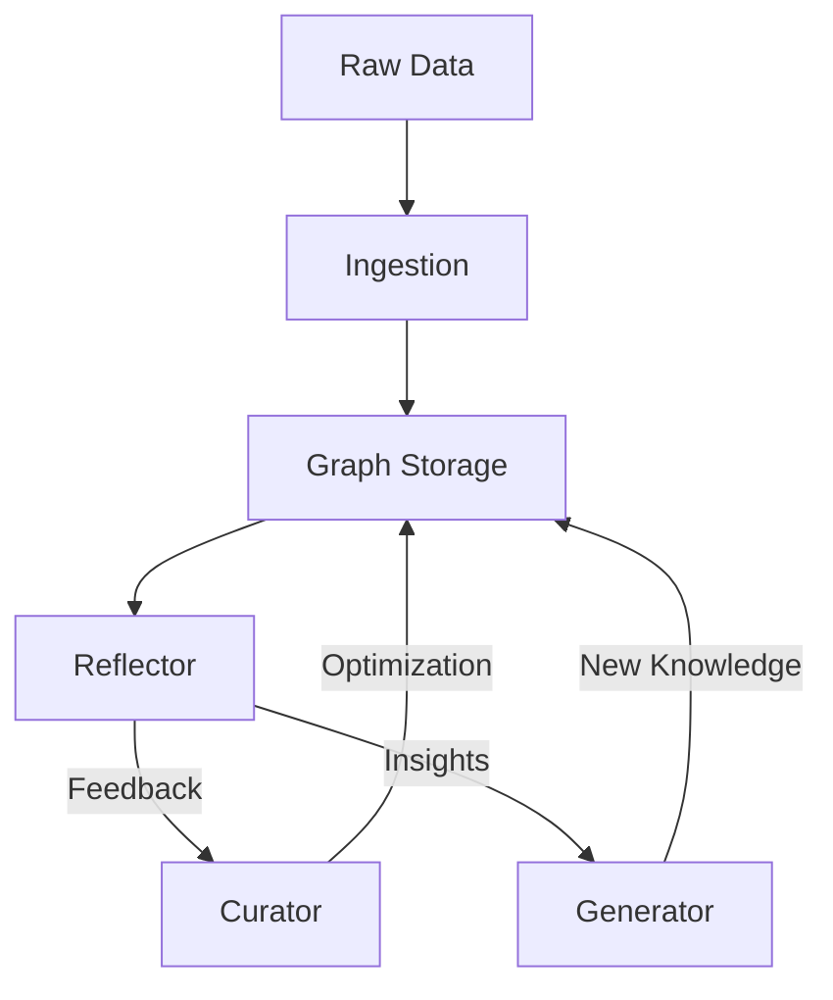

# 🧬 Agentic Context Evolution (ACE) Framework

**ACE** is LightRAG's advanced layer for autonomous graph refinement and context optimization. It transforms a static knowledge graph into an evolving, high-quality retrieval system through agentic loops.

## 🏗️ Core Components

1. **Curator**: responsible for cleaning and deducing missing information in the knowledge graph. It fixes redundant entities and standardizes relationship types.
2. **Reflector**: Monitor's retrieval performance and identifies "low-quality" regions of the graph. It generates feedback for the Curator and Generator.
3. **Generator**: Synthesizes new knowledge or "playbooks" based on the patterns discovered in the graph.
4. **Playbooks**: Dynamic, task-specific instructions that guide the RAG system on how to traverse the graph for specific domains (e.g., "Financial Multi-hop Reasoning").

## 🔄 The ACE Loop



## 🚀 Benefits

- **Autonomous Self-Healing**: Automatically identifies and repairs broken extraction nodes.
- **Contextual Awareness**: Learns the best traversal paths for your specific dataset over time.
- **Reduced Hallucinations**: Continually refines the "facts" stored in the graph for higher precision.

## ⚙️ Model Recommendations

The effectiveness of the ACE loop is highly dependent on the reasoning capability of the **Reflector** component.

- **Reflector (Critical)**: Recommend **7B models or larger** (e.g., `qwen2.5-coder:7b`). Smaller models (<3B) lack the critical discernment to distinguish between a hallucinated graph edge and the source text, often "accepting" the hallucination as fact.
- **Generator**: 3B+ models are sufficient for general query generation when guided by high-quality playbooks.
- **Curator**: 1.5B+ models are acceptable for standard structural repairs like deduplication.

For detailed latency and accuracy metrics, see [MODEL_PROFILING_RESULTS](../MODEL_PROFILING_RESULTS.md).

## 🛡️ Reasoning Threshold Policy (Review Before Deployment)

Effective from **v0.5.0**, the ACE framework enforces a **Minimum Reasoning Threshold** for the Reflector component to prevent graph corruption.

### The Policy

- **Requirement**: The model used for `reflection_llm_model_name` MUST have at least **7 Billion Parameters** (e.g., `qwen2.5-coder:7b`).
- **Rationale**: Empirical testing shows that models < 7B (like 1.5B or 3B) often fail to distinguish between *structural* graph errors and *semantic* nuances, leading to "repair" actions that actually damage the graph (e.g., merging distinct entities incorrectly).
- **Enforcement**: Use of a small model for reflection will raise a `ValueError` at initialization.
- **Override**: For experimentation or resource-constrained environments, you can bypass this check by setting `ace_allow_small_reflector=True` in the `LightRAG` configuration.

---

## 📚 Resources

- [ACE Core Implementation](../lightrag/ace/)
- [SOTA Roadmap](SOTA_ROADMAP.md)

## 🔬 Discoveries

### Hallucination by Proximity

During testing with the `qwen2.5-coder:1.5b` model on beekeeping texts, we discovered a "Hallucination by Proximity" phenomenon. The LLM incorrectly created a semantic relationship between **Beekeeper** and **Heart Disease** because the source text mentioned Cardiologists diagnosing heart disease immediately after a paragraph about beekeeping.

**Example Edge:**

```xml
<edge source="Beekeeper" target="Heart Disease">
  <data key="d8">Beekeepers diagnose potential heart issues...</data>
</edge>
```

This discovery validates the critical need for **ACE Phase 3**, where the **Reflector** will verify edges against source chunks and the **Curator** will prune such illogical connections.
