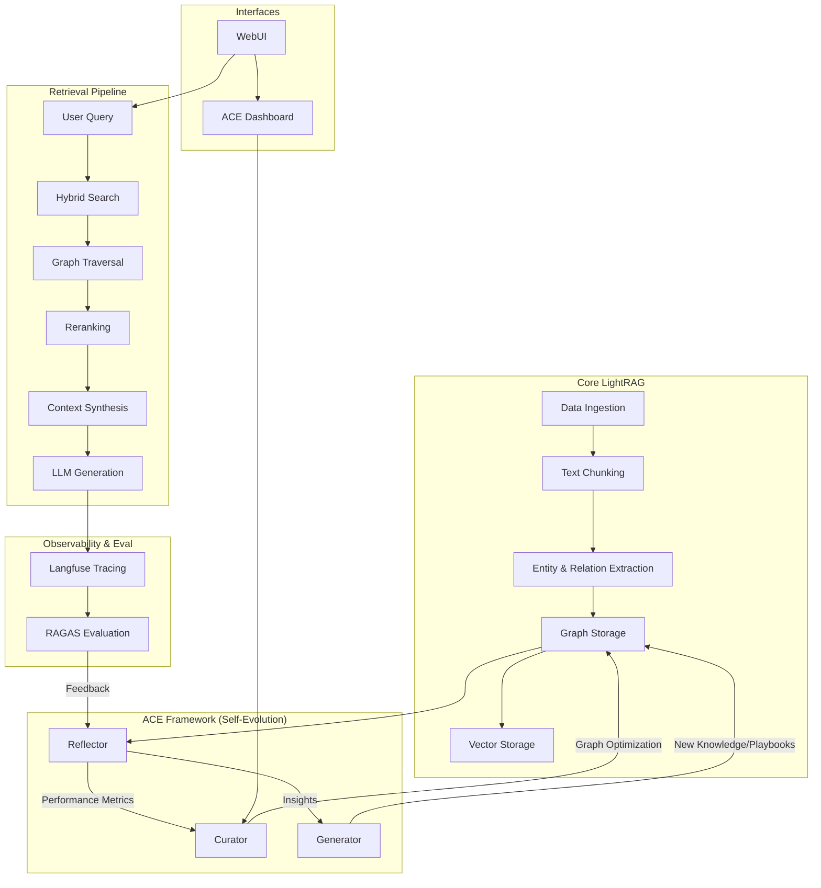

# 🏛️ LightRAG System Architecture

This document outlines the major components of the LightRAG system and their
interactions, including the **Agentic Context Evolution (ACE)** framework.

## 🗺️ High-Level Overview

## 🧩 Major Subsystems

### 1. LightRAG Core

Handles the conversion of raw text into a dual-format knowledge representation:

- **Graph Storage**: Captures semantic relationships between entities (e.g.,
  Neo4j, Memgraph, or JSON). [Learn more about MemGraph Storage](subsystems/GRAPH_STORAGE.md).

- **Vector Storage**: Stores embeddings for high-speed similarity search
  (e.g., NanoVectorDB).

- **Extraction Pipeline**: Detailed logic for chunking and LLM-based entity/relation
  extraction. [Learn more about Extraction](subsystems/EXTRACTION.md) and the [Core Algorithm](Algorithm.md).

### 2. ACE Framework (Agentic Context Evolution)

The "brain" that optimizes the system over time. [Learn more about ACE](subsystems/ACE.md).

- **Reflector**: Analyzes traces to identify knowledge gaps or low-quality retrievals.
- **Curator**: Standardizes naming, merges redundant nodes, and repairs the graph.
- **Generator**: Distills patterns into "Playbooks" for specialized domain reasoning.

### 3. Retrieval Pipeline

A multi-stage process that leverages the graph structure:

- **Hybrid Search**: Combines keyword search with vector similarity.

- **Graph Reranking**: Prioritizes key entities and relations before token limits
  are hit.

- **UI Enhancements**: Semantic highlighting and 3D graph exploration.
  [Learn more about UI Features](subsystems/UI_FEATURES.md).

### 4. Observability Layer

Integrated with **Langfuse** and **RAGAS** to provide real-time monitoring and
quantitative quality scores for every interaction. [Learn more about Observability](subsystems/OBSERVABILITY.md).

### 📄 Developer Resources

- [Concurrent Processing Explanation](LightRAG_concurrent_explain.md)
- [uv.lock Management Guide](UV_LOCK_GUIDE.md)
- [Testing Infrastructure Summary](TESTING_SUMMARY.md)
