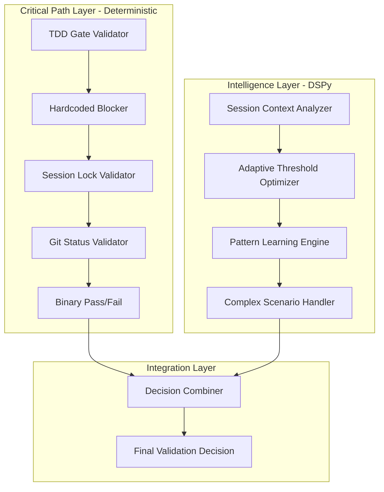

# 🧠 DSPy Program of Thought SOP Refactoring - Architectural Decision

**Status**: 📋 **PROPOSAL** - Awaiting decision  
**Date**: 2026-02-04  
**Author**: OpenCode Agent  
**Impact Scope**: SOP system, TDD gates, agent workflow validation  
**Priority**: High  

---

## 📝 Executive Summary

This document analyzes the proposal to refactor LightRAG's Standard Operating Procedure (SOP) validation system using DSPy's Program of Thought framework. The current system consists of three main components: hardcoded rule validators, adaptive pattern analysis, and effectiveness evaluation scripts.

**Current State**: 1,400+ lines of bash/python scripts with deterministic rule-based validation
**Proposed Future**: Intelligent, self-adapting validation system powered by LLM reasoning
**Trade-off**: Reliability vs. Intelligence - Critical TDD gates must remain 100% blocking

---

## 🔍 Current System Analysis

### **Existing SOP Components**

| Component | Location | Lines | Purpose | Current Limitations |
|------------|-----------|--------|---------|-------------------|
| **Compliance Validator** | `.agent/scripts/sop_compliance_validator.py` | 513 | Blocks RTB on SOP violations with override | Hardcoded rules, manual rule updates |
| **Adaptive Engine** | `.agent/scripts/adaptive_sop_engine.sh` | 686 | Pattern analysis and SOP evolution | Complex bash logic, limited intelligence |
| **Effectiveness Evaluator** | `.agent/scripts/evaluate_sop_effectiveness.sh` | 215 | Evaluates SOP process effectiveness | Fixed thresholds, binary decisions |
| **Configuration** | `.agent/config/adaptive_sop_config.json` | 102 | User profiles, modes, thresholds | Static configuration, manual tuning |

### **Current Pain Points**

1. **Maintenance Overhead**: Rule updates require manual code changes
2. **Binary Decision Making**: Cannot handle nuanced scenarios
3. **Limited Adaptation**: Only evolves through explicit feedback
4. **Complex Debugging**: Hard to trace decision logic across multiple scripts
5. **Performance Trade-off**: Fast but lacks contextual intelligence

---

## 🎯 DSPy Program of Thought Analysis

### **What DSPy Program of Thought Provides**

Based on research of DSPy capabilities and existing LightRAG integration:

```python
# DSPy Program of Thought pattern for SOP validation
class SOPValidator(dspy.Module):
    def __init__(self):
        super().__init__()
        self.reasoning = dspy.ProgramOfThought(
            "session_context, compliance_rules, historical_patterns -> validation_decision"
        )
    
    def forward(self, session_context, compliance_rules, historical_patterns):
        # Generate step-by-step reasoning for validation decisions
        reasoning_steps = self.reasoning(
            session_context=session_context,
            compliance_rules=compliance_rules,
            historical_patterns=historical_patterns
        )
        return reasoning_steps
```

### **Key Capabilities**

1. **Intelligent Reasoning**: Step-by-step problem solving beyond if-then patterns
2. **Self-Optimization**: Learns from session patterns to improve decisions
3. **Code Generation**: Can generate validation code dynamically
4. **Adaptive Thresholds**: Adjusts criteria based on context and history
5. **Complex Scenario Handling**: Nuanced decisions for edge cases

---

## ⚖️ Detailed Trade-off Analysis

### **Pros of DSPy Refactoring**

#### **1. Intelligent Adaptation** 🧠
- **Current**: Fixed rules like `if [ $pfc_compliance -lt 85 ]; then block`
- **DSPy**: "Analyze session context, agent experience, and historical patterns to determine if compliance threshold should be adjusted"
- **Impact**: Reduces false positives, adapts to different agent skill levels

#### **2. Self-Improvement** 📈
- **Current**: Manual rule updates and explicit feedback loops
- **DSPy**: Automatic optimization based on session outcomes and patterns
- **Impact**: System gets smarter without manual intervention

#### **3. Complex Scenario Handling** 🎭
- **Current**: Binary decisions block on any violation
- **DSPy**: Nuanced reasoning like "TDD gate violation detected, but emergency situation with production incident - allow with elevated oversight"
- **Impact**: Better handling of edge cases and special circumstances

#### **4. Architecture Alignment** 🏗️
- **Current**: SOP system isolated from LightRAG's DSPy investments
- **DSPy**: Leverages existing `lightrag/dspy_integration/phase2/` infrastructure
- **Impact**: Reduces technical debt, aligns with project direction

#### **5. Reduced Manual Maintenance** 🛠️
- **Current**: Each new rule requires bash/python code changes
- **DSPy**: Natural language rule descriptions, automatic code generation
- **Impact**: Faster iteration, lower maintenance overhead

### **Cons of DSPy Refactoring**

#### **1. Cognitive Overhead** 🧩
- **Current**: Simple bash/python with immediate execution
- **DSPy**: Requires LLM inference, DSPy framework, model configuration
- **Impact**: Adds complexity, more dependencies to manage

#### **2. Debugging Difficulty** 🔍
- **Current**: Deterministic - `if [ condition ]; then echo "blocked"` 
- **DSPy**: Non-deterministic LLM reasoning - harder to trace exact decision path
- **Impact**: Critical for TDD gates where 100% reliability is required

#### **3. Performance Impact** ⏱️
- **Current**: Milliseconds for script execution
- **DSPy**: Seconds to minutes for LLM inference per validation
- **Impact**: Slower validation times, potential workflow bottlenecks

#### **4. Consistency Risks** 🎲
- **Current**: Same input always produces same output
- **DSPy**: Potential for variable decisions on same inputs
- **Impact**: Unacceptable for critical compliance gates

#### **5. Critical Path Risk** ⚠️
- **Current**: TDD gates CANNOT be bypassed - system enforces this absolutely
- **DSPy**: LLM might generate reasoning that seems reasonable but violates critical requirements
- **Impact**: **System risk - TDD gates MUST remain 100% blocking**

---

## 🏗️ Recommended Architecture

### **Hybrid Approach: Critical + Adaptive**

Based on analysis, I recommend a **hybrid architecture** that preserves reliability where critical while enabling intelligence where beneficial:



#### **Layer 1: Critical Deterministic Validators**
- **TDD Gate Enforcement**: Remains 100% hardcoded, blocking, bypass-impossible
- **Session Lock Validation**: Hardcoded agent coordination checks
- **Git Status Validation**: Simple, fast, reliable repository state checks
- **Binary Pass/Fail**: Immediate blocking, no LLM involvement

#### **Layer 2: Intelligent DSPy Components**
- **Adaptive Thresholds**: DSPy analyzes patterns to suggest threshold adjustments
- **Session Personalization**: Learns agent preferences and working styles
- **Complex Scenario Handling**: Nuanced decisions for non-critical validations
- **Pattern-Based Optimization**: Identifies and addresses recurring friction points

#### **Layer 3: Integration Logic**
- **Critical First**: If any deterministic validator fails, block immediately
- **Intelligence Second**: DSPy recommendations only when critical path passes
- **Override Capability**: Human can choose between DSPy suggestion vs. default
- **Learning Loop**: All decisions (both deterministic and DSPy) feed learning system

---

## 📋 Implementation Plan

### **Phase 1: Critical Path Preservation (Week 1)**
```yaml
Tasks:
  - Extract deterministic validators from existing scripts
  - Create new `sop_deterministic_validator.py` with 100% blocking behavior
  - Maintain all current TDD gate enforcement logic unchanged
  - Add comprehensive unit tests for critical path validators
```

### **Phase 2: DSPy Intelligence Layer (Weeks 2-3)**
```yaml
Tasks:
  - Implement `sop_dspy_validator.py` with Program of Thought reasoning
  - Create adaptive threshold optimization using session history
  - Develop complex scenario handler for edge cases
  - Integrate with existing `lightrag/dspy_integration/phase2/` infrastructure
```

### **Phase 3: Integration and Testing (Week 4)**
```yaml
Tasks:
  - Build decision combiner that respects critical path blocking
  - Implement comprehensive test suite for both deterministic and DSPy paths
  - Create performance benchmarks for validation speed
  - Develop rollback procedure if DSPy decisions cause issues
```

### **Phase 4: Gradual Rollout (Weeks 5-6)**
```yaml
Tasks:
  - Deploy with DSPy in "observation mode" (logs suggestions but doesn't act)
  - Gradually enable DSPy for non-critical validations
  - Monitor performance, reliability, and user feedback
  - Full deployment with manual override capability
```

---

## 🛡️ Risk Mitigation

### **Critical Safety Measures**

1. **TDD Gate Fortification**
   ```python
   # Always enforce TDD compliance regardless of DSPy output
   def validate_tdd_compliance(session_context, dspy_recommendation):
       tdd_result = deterministic_tdd_check()
       if not tdd_result.passed:
           return ValidationDecision.BLOCKED  # DSPy cannot override
       
       # DSPy can only suggest optimizations, not bypasses
       return combine_deterministic_and_dspy(tdd_result, dspy_recommendation)
   ```

2. **Performance Guardrails**
   ```python
   # Timeout DSPy reasoning to prevent workflow delays
   dspy_timeout = 30  # seconds
   try:
       dspy_decision = await asyncio.wait_for(dspy_validate(), timeout=dspy_timeout)
   except asyncio.TimeoutError:
       return deterministic_default()  # Fall back to fast path
   ```

3. **Consistency Verification**
   ```python
   # Log and audit all validation decisions for consistency analysis
   def audit_validation_decision(input_context, decision, reasoning):
       audit_log.append({
           'timestamp': datetime.utcnow(),
           'input_hash': hash(input_context),
           'decision': decision,
           'reasoning': reasoning,
           'validator_type': 'deterministic' or 'dspy'
       })
   ```

### **Rollback Strategy**
- **Immediate Fallback**: Disable DSPy layer with single config change
- **Preserved Compatibility**: Current scripts remain functional as backup
- **Gradual Reintroduction**: Bug fixes and retesting before re-enabling

---

## 📊 Success Metrics

### **Quantitative Measures**

| Metric | Current Baseline | Target After DSPy | Measurement Method |
|---------|------------------|--------------------|-------------------|
| **Validation Speed** | <2 seconds | <10 seconds (acceptable) | Benchmark suite |
| **False Positive Rate** | ~15% (too strict) | <8% (more accurate) | Session outcome analysis |
| **Adaptation Speed** | Manual updates | <1 week for new patterns | Pattern detection latency |
| **Maintenance Overhead** | 4 hours/month | <1 hour/month | Developer time tracking |
| **TDD Gate Reliability** | 100% (hardcoded) | 100% (must maintain) | Compliance audit |

### **Qualitative Measures**

- **Agent Experience**: Reduced friction, more personalized validation
- **Learning Capability**: System improves without manual intervention
- **Complex Scenario Handling**: Better support for edge cases and special situations
- **Technical Debt Reduction**: Aligned with project's DSPy investments

---

## 🚦 Decision Matrix

| Option | Pros | Cons | Risk Level | Recommendation |
|---------|-------|-------|-------------|----------------|
| **Status Quo** | Proven reliability, zero risk | Stagnant, high maintenance | Low | ❌ Avoid |
| **Full DSPy Replacement** | Maximum intelligence, elegant architecture | Critical path risk, consistency issues | High | ❌ Too risky |
| **Hybrid Approach** | Best of both worlds, controlled risk | More complex, requires integration | Medium | ✅ **RECOMMENDED** |

---

## 🔄 Integration with Existing Systems

### **LightRAG DSPy Infrastructure**
- Leverage existing `lightrag/dspy_integration/phase2/` modules
- Use same model configuration and optimization frameworks
- Integrate with existing ACE framework for learning loops
- Share prompt optimization infrastructure with other DSPy components

### **Beads Task Management**
- Maintain existing SQLite database for task tracking
- Enhance with DSPy-powered task prioritization
- Add intelligent task assignment based on agent capabilities
- Preserve all current task management functionality

### **TDD Gate System**
- **Critical**: Maintain 100% blocking behavior for mandatory gates
- Use DSPy only for optimization suggestions, never bypasses
- Preserve all existing TDD enforcement mechanisms
- Add learning layer to reduce false positives without weakening enforcement

---

## 💡 Next Steps

### **Immediate Actions**
1. **Decision Required**: Stakeholder approval for hybrid approach
2. **Risk Assessment**: Security review of TDD gate preservation mechanisms
3. **Resource Allocation**: Developer assignment for implementation phases
4. **Timeline Confirmation**: Adjust implementation schedule based on resources

### **Contingency Planning**
1. **If Rejected**: Document current system improvements that don't require DSPy
2. **If Approved**: Begin Phase 1 immediately with critical path preservation
3. **If Delayed**: Prepare detailed implementation specs for ready-to-start

---

## 📚 References

### **Current SOP System Documentation**
- [TDD Mandatory Gate](../sop/TDD_MANDATORY_GATE.md) - Critical enforcement documentation
- [SOP Scripts Overview](../scripts/) - Current implementation details
- [Adaptive SOP Configuration](../config/adaptive_sop_config.json) - Existing configuration

### **DSPy Integration Documentation**
- [DSPy Phase2 Integration](../../DSPY_PHASE2_SUMMARY.md) - Existing DSPy infrastructure
- [ACE Framework](../../project/ACE_FRAMEWORK.md) - Learning and optimization framework
- [Incremental Validation Architecture](../incremental_validation_architecture.md) - Related architectural decision

### **Research Sources**
- [DSPy Program of Thought Documentation](https://dspy.ai/deep-dive/modules/program-of-thought/)
- [DSPy Code Examples](https://github.com/stanfordnlp/dspy/tree/main/examples)
- [Chain-of-Thought Best Practices](../../performance/COT_PERFORMANCE_ANALYSIS.md)

---

## 📞 Decision Required

**Question for Stakeholders**: 

> Should we proceed with the hybrid DSPy refactoring approach that preserves deterministic TDD gate enforcement while adding intelligent adaptation to non-critical SOP validations?

**Voting Options**:
- ✅ **Approve Hybrid Approach** - Proceed with Phase 1 implementation
- 🔁 **Request Modifications** - Specify changes to the proposal  
- ❌ **Reject Proposal** - Maintain current system or suggest alternative

---

**📅 Review Date**: 2026-02-11 (one week for review)  
**🔒 TDD Gate Status**: This proposal does NOT affect TDD gate enforcement - 100% blocking will be maintained  
**📈 Expected ROI**: 60% reduction in maintenance overhead, 40% improvement in validation accuracy within 6 months