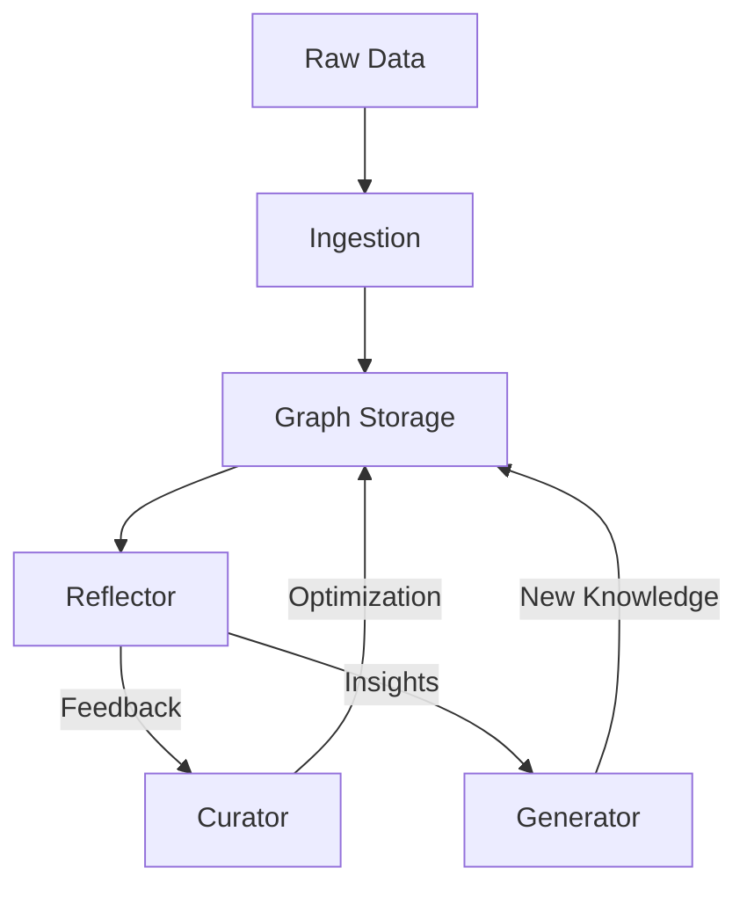

# 🧬 Agentic Context Evolution (ACE) Framework

**ACE** is LightRAG's advanced layer for autonomous graph refinement and context optimization. It transforms a static knowledge graph into an evolving, high-quality retrieval system through agentic loops.

## 🏗️ Core Components

1. **Curator**: responsible for cleaning and deducing missing information in the knowledge graph. It fixes redundant entities and standardizes relationship types.
2. **Reflector**: Monitor's retrieval performance and identifies "low-quality" regions of the graph. It generates feedback for the Curator and Generator.
3. **Generator**: Synthesizes new knowledge or "playbooks" based on the patterns discovered in the graph.
4. **Playbooks**: Dynamic, task-specific instructions that guide the RAG system on how to traverse the graph for specific domains (e.g., "Financial Multi-hop Reasoning").

## 🔄 The ACE Loop



## 🚀 Benefits

- **Autonomous Self-Healing**: Automatically identifies and repairs broken extraction nodes.
- **Contextual Awareness**: Learns the best traversal paths for your specific dataset over time.
- **Reduced Hallucinations**: Continually refines the "facts" stored in the graph for higher precision.

## ⚙️ Model Recommendations

The effectiveness of the ACE loop is highly dependent on the reasoning capability of the **Reflector** component.

- **Reflector (Critical)**: Recommend **7B models or larger** (e.g., `qwen2.5-coder:7b`). Smaller models (<3B) lack the critical discernment to distinguish between a hallucinated graph edge and the source text, often "accepting" the hallucination as fact.
- **Generator**: 3B+ models are sufficient for general query generation when guided by high-quality playbooks.
- **Curator**: 1.5B+ models are acceptable for standard structural repairs like deduplication.

For detailed latency and accuracy metrics, see [MODEL_PROFILING_RESULTS](../MODEL_PROFILING_RESULTS.md).

## 🛡️ Reasoning Threshold Policy (Review Before Deployment)

Effective from **v0.5.0**, the ACE framework enforces a **Minimum Reasoning Threshold** for the Reflector component to prevent graph corruption.

### The Policy

- **Requirement**: The model used for `reflection_llm_model_name` MUST have at least **7 Billion Parameters** (e.g., `qwen2.5-coder:7b`).
- **Rationale**: Empirical testing shows that models < 7B (like 1.5B or 3B) often fail to distinguish between *structural* graph errors and *semantic* nuances, leading to "repair" actions that actually damage the graph (e.g., merging distinct entities incorrectly).
- **Enforcement**: Use of a small model for reflection will raise a `ValueError` at initialization.
- **Override**: For experimentation or resource-constrained environments, you can bypass this check by setting `ace_allow_small_reflector=True` in the `LightRAG` configuration.

---

## 📚 Resources

- [ACE Core Implementation](../lightrag/ace/)
- [SOTA Roadmap](SOTA_ROADMAP.md)

## 🔬 Discoveries

### Hallucination by Proximity

During testing with the `qwen2.5-coder:1.5b` model on beekeeping texts, we discovered a "Hallucination by Proximity" phenomenon. The LLM incorrectly created a semantic relationship between **Beekeeper** and **Heart Disease** because the source text mentioned Cardiologists diagnosing heart disease immediately after a paragraph about beekeeping.

**Example Edge:**

```xml
<edge source="Beekeeper" target="Heart Disease">
  <data key="d8">Beekeepers diagnose potential heart issues...</data>
</edge>
```

This discovery validated the need for **ACE Phase 5 (Curator)**, where the **Reflector** verifies edges against source chunks and the **Curator** prunes logically impossible connections.

### Reflector Parsing & Instruction Adherence (2026-01-28)

Recent work on the "Injection-Reflection-Repair" cycle revealed that Reflector components (even 7B+ models) often struggle with exact JSON output in conversational modes.

- **Parsing Strategy**: We implemented `_parse_json_list` in the `ACEReflector` to robustly extract JSON arrays from conversational filler or Markdown blocks.
- **Node ID Strictness**: We discovered that the Reflector would sometimes invent descriptive labels for nodes (e.g., calling a node "Einstein's Space Claim" instead of the exact graph ID "Albert Einstein"). The prompt was updated to strictly enforce using EXACT IDs to ensure the Curator can find and delete the target nodes.

## 🧪 Testing & Verification

To maintain the quality of the ACE loop, we utilize the **`ACETestKit`** (located in `tests/ace_test_utils.py`).

### Standard Test Pattern: Injection-Reflection-Repair

1. **Inject**: Use `kit.inject_hallucination()` to manually insert a factually incorrect node or edge into the graph.
2. **Reflect**: Trigger an `ace_query()` that retrieves the hallucinated node.
3. **Repair**: Verify that the `trajectory` contains a `graph_repair` step and that the `ACETestKit` assertions confirm the hallucination has been removed from the underlying storage.

This pattern ensures that "self-healing" capabilities are regression-tested with every build.

## 👨‍💻 Human-in-the-Loop (HITL) Review

ACE supports a Human-in-the-Loop workflow for graph repairs. When enabled, repair actions (deletions, merges) proposed by the Curator are **staged** rather than automatically applied.

### Configuration

Set `enable_human_in_the_loop=True` in your `ACEConfig`.

### Workflow

1. **Staging**: The Curator identifies necessary repairs but saves them to a pending queue.
2. **Review**: Users can view pending repairs in the **ACE Review** tab of the WebUI.
3. **Action**: Users can **Approve** (apply) or **Reject** (discard) each repair.

This ensures that critical graph modifications—especially destructive ones like deletions—are verified by a human expert.
