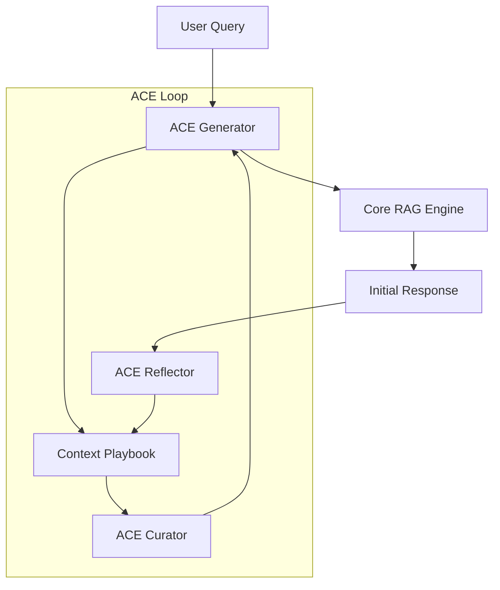

# Agentic Context Evolution (ACE)

The ACE framework is a high-priority prototype designed to enable
**continuous learning** and **context optimization** within the LightRAG
retrieval loop. It moves beyond static RAG by evolving the context and
retrieval strategies based on real-time feedback and historic performance.

## Architecture Overview

ACE follows a modular design where multiple specialized agents interact with
a shared **Context Playbook**.

## Core Components

### 1. ACE Generator (`generator.py`)

The Generator is responsible for formulating the final response to the user.
Unlike a standard RAG generator, it:

- Consults the **Playbook** for relevant "lessons learned" or style guidelines.
- Uses **evolutionary prompts** that adapt based on the complexity of the query.
- Orchestrates the retrieval process by requesting specific context types
  (Entities, Relations, or Hybrid) from the core engine.

### 2. ACE Reflector (`reflector.py`)

The Reflector acts as the "critic" in the loop. It analyzes the generated
responses and the retrieved context to:

- Identify retrieval failures (e.g., missing information, irrelevant nodes).
- Detect hallucinations or inconsistencies.
- Generate **insights** or "lessons" to be added to the Playbook.

### 3. ACE Curator (`curator.py`)

The Curator manages the health and relevance of the **Knowledge Graph** and the
**Playbook**. It:

- Prunes redundant or outdated insights from the Playbook.
- Identifies high-value "hot spots" in the knowledge graph that should be
  prioritized for future queries.
- Optimizes the retrieval parameters (like `top_k`) based on the current
  context density.

### 4. Context Playbook (`playbook.py`)

The Playbook is the "memory" of the ACE framework. It stores:

- **Lessons Learned**: Tactical advice on how to handle specific query patterns.
- **Context Insights**: Summarized value of specific entities or relations for
  certain topics.

- **Success Patterns**: Documented flows that led to high-quality responses.

## Interaction Flow

1. **Query Arrival**: A query enters through the `/ace/query` endpoint.
2. **Strategic Retrieval**: The Generator identifies the best retrieval mode
   and consults the Playbook for initial guidance.

3. **Context Assembly**: Core LightRAG retrieves data from MemGraph and Vector storage.
4. **Response Generation**: The Generator produces the answer, incorporating
   Playbook wisdom.

5. **Offline Reflection**: After the response is served, the Reflector
   analyzes the interaction and updates the Playbook with new insights.
6. **Continuous Curation**: Periodically, the Curator refines the Playbook to
   ensure it remains a high-quality strategic asset.

## Future Roadmap (ACE Phase 4+)

- **Dynamic Tool Use**: Allowing ACE to decide when to call external APIs or
  specialized extraction routines.
- **Multi-Agent Playbooks**: Shared memory across specialized agent instances.
- **Automated Parameter Tuning**: Self-adjusting `cosine_threshold` and `rerank`
  toggles based on performance metrics.
