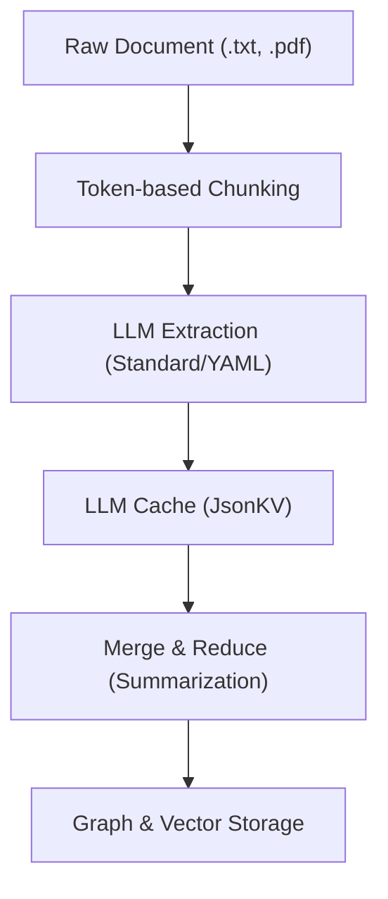

# Extraction Pipeline

The extraction pipeline is the heart of LightRAG's "Knowledge Ingestion" phase.
It transforms raw unstructured text into a structured knowledge graph composed
of entities and relationships.

## Pipeline Architecture

The process is divided into four distinct stages:

## Stage 1: Token-based Chunking

Instead of splitting by character count or paragraph, LightRAG uses a
**Tokenizer-aware** approach.

- **`chunk_token_size`**: Default 1200 tokens.
- **`chunk_overlap_token_size`**: Default 100 tokens.
- **Benefit**: Ensures that chunks fit perfectly within the LLMs context window
  without cutting off important semantic units.

## Stage 2: Entity & Relation Extraction

LightRAG employs a multi-format extraction strategy to support different LLM
capabilities.

### 1. Standard Format

Uses a prescriptive prompt to extract entities and relations in a structured
(often JSON-like) list.

### 2. YAML Format

A robust alternative designed for smaller LLMs (like Qwen2.5-Coder 1.5B/7B).
It forces the model to output data in a YAML structure, which is more resilient
to formatting errors and easier to parse using `json_repair` or `pyyaml`.

## Stage 3: LLM Response Caching

To optimize cost and speed, every LLM extraction result is cached in a
Key-Value store (`JsonKVStorage`).

- If a document is re-ingested, LightRAG checks the cache.
- If the chunk hash matches, it bypasses the LLM and uses the cached
  extraction.

## Stage 4: Merge & Reduce (Summarization)

When multiple chunks describe the same entity (e.g., "Elon Musk" mentioned in
5 different articles), LightRAG must merge these descriptions.

### Map-Reduce Strategy

1. **Map**: Each chunk provides a description.
2. **Filter**: If descriptions are minimal, they are joined by a separator.
3. **Reduce**: If the total token count exceeds the `summary_context_size`,
   an LLM is used to summarize all descriptions into a single, cohesive
   biography or relationship summary.

## Key Configuration

| Variable | Default | Purpose |
| :--- | :--- | :--- |
| `MAX_GLEANING` | 1 | Attempts to extract missed entities from ambiguous text. |
| `EXTRACTION_FORMAT` | `standard` | Toggle between `standard` and `yaml`. |
| `ENTITY_TYPES` | `organization,person,...` | Filter for specific categories. |

## Error Resilience

- **Text Normalization**: All extracted names are normalized (stripped of
  quotes, lowercased for type check) to prevent duplicate nodes.
- **JSON Repair**: Uses `json_repair` to fix common LLM formatting errors
  (missing brackets, trailing commas).
- **Transient Retries**: Automatically retries failed LLM calls with
  exponential backoff.
