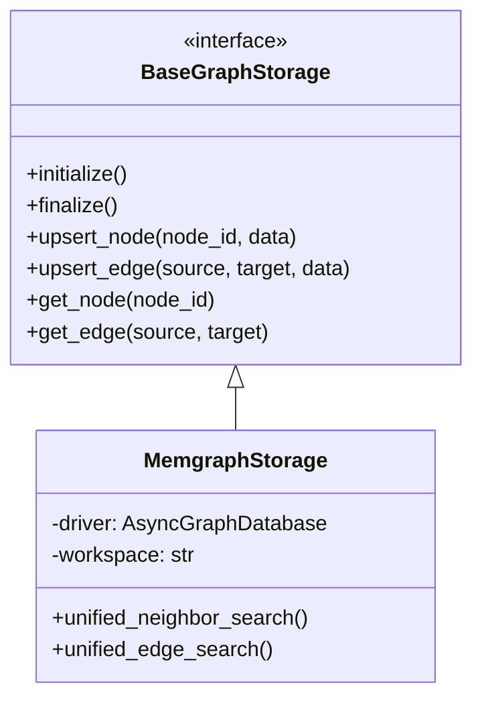

# Graph Storage (MemGraph)

LightRAG uses a graph-based data model to store entities and their
relationships. While it supports multiple backends (NetworkX, Neo4j, etc.),
**MemGraph** is the premium choice for high-performance, real-time graph
operations with integrated vector search capabilities.

## Architecture Overview

The Graph Storage layer is abstraction-driven, allowing for pluggable backends
while maintaining a consistent `BaseGraphStorage` interface.



## Schema Design

MemGraph implementation uses a highly optimized schema for fast retrieval and
data isolation.

### 1. Node Properties

Nodes represent entities (People, Organizations, Concepts, etc.).

- **`entity_id`**: The unique name or identifier of the entity (e.g., "Albert
  Einstein").

- **`entity_type`**: The category (e.g., "Person").
- **`description`**: A summarized description of the entity.
- **`labels`**: Array of types/categories.
- **`created_at`**: ISO timestamp.

### 2. Edge Properties

Edges represent relationships between entities.

- **`weight`**: Strength or frequency of the relationship.
- **`description`**: Contextual explanation of the connection.
- **`keywords`**: Searchable terms related to the link.
- **`source_id`**: Reference to the document chunk that generated this edge.

### 3. Data Isolation (Workspaces)

To support multi-tenancy or project separation, LightRAG uses Cypher labels for
partitioning.

- Every node/edge is tagged with a **workspace label** (e.g., `:base`,
  `:project_alpha`).
- Queries are restricted to these labels, ensuring data from different
  workspaces never leaks.

## Integrated Vector Search

One of the unique features of the Memgraph backend is the **Unified Search**.

Instead of performing separate vector and graph lookups, Memgraph uses a
specialized Cypher procedure to perform vector searches directly on node/edge
properties within the graph database.

```cypher
CALL vector_search.search($index_name, $top_k, $embedding)
YIELD node, similarity
MATCH (node:`workspace_label`)
...
```

## Transaction & Retry Logic

MemGraph storage implements robust manual transaction-level retry logic to
handle **TransientErrors** (like lock conflicts during parallel ingestion).

- **Max Retries**: 100
- **Exponential Backoff**: Starts at 0.2s with jitter.
- **Isolation**: Uses `AsyncManagedTransaction` for ACID compliance.

## Configuration

Set the following in your `.env` to use MemGraph:

```bash
GRAPH_STORAGE=MemgraphStorage
MEMGRAPH_URI=bolt://localhost:7687
MEMGRAPH_USERNAME=
MEMGRAPH_PASSWORD=
MEMGRAPH_DATABASE=memgraph
```

## Performance Benefits

- **Sub-millisecond Traversals**: Optimized for relationship-heavy queries.
- **Reduced Overhead**: Integrated vector storage eliminates the need for a
  separate vector database synchronization.
- **ACID Compliant**: Guaranteed data consistency even under high write load.
