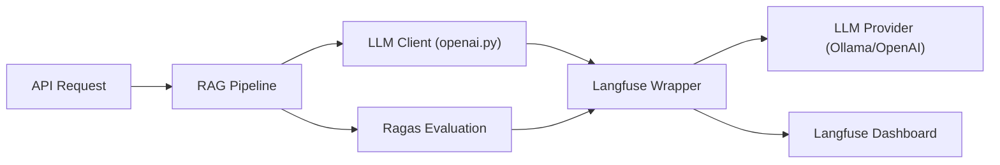

# Observability & Tracing

LightRAG integrates with **Langfuse** to provide deep observability into LLM
interactions, tracing pipeline execution, and benchmarking system performance.

## Architecture Overview

Observability is implemented as a transparent layer that wraps the standard LLM
client.



## Core Integration: Langfuse

The primary integration point is in `lightrag/llm/openai.py`. It uses a
conditional import strategy to remain lightweight when observability is not
needed.

### 1. Transparent Wrapping

When `LANGFUSE_PUBLIC_KEY` and `LANGFUSE_SECRET_KEY` are detected in the
environment, the standard `AsyncOpenAI` client is replaced with the
`langfuse.openai.AsyncOpenAI` wrapper.

```python
# From lightrag/llm/openai.py
if langfuse_public_key and langfuse_secret_key:
    from langfuse.openai import AsyncOpenAI
    LANGFUSE_ENABLED = True
else:
    from openai import AsyncOpenAI
```

### 2. Traceable Events

Langfuse automatically captures:

- **Prompts**: The exact text sent to the LLM.
- **Completion**: The raw response from the LLM.
- **Latency**: Time taken for each request.
- **Token Usage**: Accurate counts of prompt and completion tokens.
- **Status**: Success or failure (with error logs).

## Evaluation Benchmarks (RAGAS)

Observability extends to the evaluation phase. The `eval_rag_quality.py` script
uses Langfuse to store and visualize evaluation results.

| Metric | Description | Target |
| :--- | :--- | :--- |
| **Faithfulness** | Are the answers derived solely from context? | > 0.8 |
| **Answer Relevance** | Does the answer address the query? | > 0.8 |
| **Context Precision** | Is the retrieved context relevant? | > 0.7 |
| **Context Recall** | Does the context contain the answer? | > 0.7 |

## Tracing Pipeline Implementation

Traces can be viewed at the granular level, allowing developers to see:

1. **Extraction**: The prompt used for entity/relation extraction and its result.
2. **Retrieval**: Which nodes were picked from MemGraph and their vector
   similarity scores.

3. **Generation**: The final synthesis step.

## Setup & Configuration

To enable observability, set the following environment variables in `.env`:

```bash
LANGFUSE_PUBLIC_KEY=pk-lf-...
LANGFUSE_SECRET_KEY=sk-lf-...
LANGFUSE_HOST=https://cloud.langfuse.com # or local instance
```

## Benefits

- **Debugging**: Easily identify which part of the pipeline (Retrieval vs.
  Generation) is failing.
- **Optimization**: Analyze token usage to reduce costs.
- **Regression Testing**: Compare performance across different LLM models or
  `top_k` settings.
