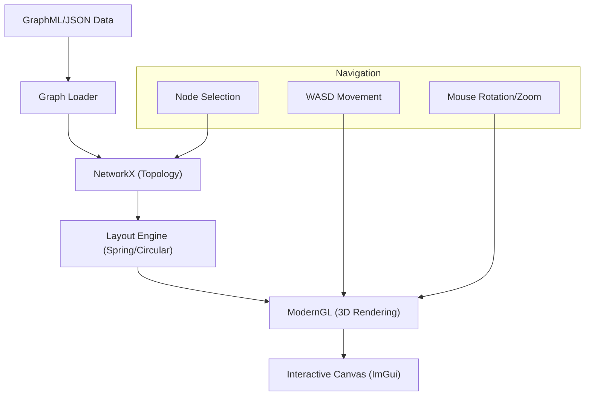

# UI Features & Visualization

LightRAG provides a sophisticated WebUI designed for interactive exploration of
retrieval results and the underlying knowledge graph. Two flagship features are
**Semantic Highlighting** and **3D Graph Visualization**.

## 1. Semantic Highlighting

Semantic highlighting goes beyond keyword matching. It uses a transformer model
to identify the most relevant sentences in a retrieved context relative to the
user's query.

### Backend Implementation

The backend uses a specialized model from Zilliz (`zilliz/semantic-highlight-bilingual-v1`).

- **Route**: `POST /highlight`
- **Core Logic**: `lightrag/highlight.py`
- **Mechanism**:
    1. The query and context are passed to the `get_highlights` function.
    2. The model computes a relevance score for each sentence in the context.
    3. Sentences exceeding the `threshold` (default 0.6) are returned as highlights.

### Frontend Integration

The WebUI receives the list of relevant sentences and confidence scores.
It then:

- Scans the rendered context.
- Wraps matching sentences in `<mark>` tags or applies a thematic background color.
- Adjusts the intensity of the highlight based on the confidence score.

## 2. 3D Graph Visualization

The Knowledge Graph Visualization allows users to navigate the complex
relationships extracted from their documents in a 3D space.

### Architecture Overview

### Key Technical Aspects

- **Layout Algorithms**: Supports Spring, Circular, Shell, and Random layouts
  via NetworkX.

- **Node Selection & Hovering**: Implemented using a specialized
  **Id Framebuffer**. Each node is rendered to a hidden buffer with a unique
  color representing its ID, allowing for pixel-perfect hover detection.

- **Community Detection**: Uses the Louvain algorithm to group nodes into
  communities, which are then colored consistently for easier visual analysis.

- **3D Camera**: A complete Fly-through camera with WASD navigation and
  mouse-based look-around.

### Interaction Features

- **Node Details**: Clicking a node reveals its full description, type, and
  list of direct connections.

- **Dynamic Filtering**: The UI allow filtering by entity type or relationship
  strength (via "Edge Width" and "Node Scale" settings).

- **Label Culling**: Distance-based label rendering to prevent visual clutter
  in dense graphs.

## Integration & Performance

- **Lazy Loading**: The semantic highlight model is loaded only on the first
  request to save memory.
- **GPU Acceleration**: Both the highlighting model and the 3D visualizer use
  hardware acceleration (CUDA/MPS for the model, OpenGL for the graph).
